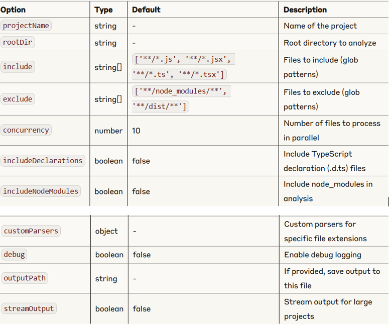

# Code Graph Generator

Generate detailed code structure graphs for JavaScript/TypeScript projects.

# Code Graph Generator

<p align="center">
  
</p>

<p align="center">
  <a href="https://www.npmjs.com/package/code-graph-generator"></a>
  <a href="https://github.com/Aman-s12345/code-graph-generator/actions"></a>
  <a href="https://github.com/Aman-s12345/code-graph-generator/blob/main/LICENSE"></a>
</p>

Generate detailed code structure graphs for JavaScript and TypeScript projects. Analyze dependencies, function calls, React components, and more.

## Features

- **Static Code Analysis**: Parse and analyze JS, TS, JSX, and TSX files
- **Dependency Tracking**: Map the relationships between files, functions, and modules
- **React-Aware**: Detect React components, hooks, and their relationships
- **Memory Efficient**: Process large codebases with optimized memory usage
- **Relationship Analysis**: Track function calls, component hierarchies, and module imports
- **TypeScript Support**: Full support for TypeScript and type information
- **Large Codebase Friendly**: Efficiently process projects with 1000+ files

## Installation

  ```bash
     npm i code-graph-generator
  ```


## Features

- Analyze JS, TS, JSX, and TSX files
- Detect React components and their relationships
- Track function calls and dependencies
- Identify module imports/exports
- Analyze React hooks usage
- Memory-efficient for large codebases


## Uses
```bash
import { createCodeGraph } from 'code-graph-generator';

const graph = await createCodeGraph({
  projectName: 'My Project',
  rootDir: './src',
  includeDeclarations: false,
  concurrency: 10
});

console.log(JSON.stringify(graph, null, 2));
```
## Response Schema for code-graph-generator
Here's the schema representation for the output returned by code-graph-generator:
```bash
{
  "name": "string",
  "packages": [
    {
      "name": "string",
      "files": [
        {
          "path": "string",
          "types": [
            {
              "name": "string",
              "file": "string",
              "startLine": "number",
              "length": "number",
              "properties": [
                {
                  "name": "string",
                  "type": "string",
                  "parameters": ["string"]
                }
              ]
            }
          ],
          "variables": [
            {
              "name": "string",
              "type": "string",
              "dependencies": [
                {
                  "string": "string"
                }
              ]
            }
          ],
          "functions": [
            {
              "fileName": "string",
              "name": "string",
              "referencedIn": ["string"],
              "startLine": "number",
              "length": "number",
              "dependencies": [
                {
                  "string": "string"
                }
              ],
              "types": ["string"],
              "callsTo": ["string"],
              "calledBy": ["string"]
            }
          ],
          "dependencies": ["string"],
          "exports": ["string"],
          "detailedDependencies": [
            {
              "module": "string",
              "imports": ["string"]
            }
          ],
          "componentHierarchy": {
            "string": {
              "renders": ["string"],
              "renderedBy": ["string"]
            }
          }
        }
      ],
      "dependencies": ["string"],
      "exports": ["string"]
    }
  ]
}
```
## Schema Description:
```bash


name: Project name
packages: Array of package objects
  name: Package name (e.g., "src", ".")
  files: Array of file objects
    path: File path relative to project root
    types: Array of type definitions (interfaces, types, etc.)
      name: Type name
      file: File where type is defined
      startLine: Line number where type starts
      length: Number of lines in the type definition
      properties: Array of properties in the type
        name: Property name
        type: Property type
        parameters: Array of parameter types (for methods)
    variables: Array of variable definitions
      name: Variable name
      type: Variable type (e.g., "State", "StateSetter")
      dependencies: Array of dependencies for this variable
    functions: Array of function definitions
      fileName: Name of file containing the function
      name: Function name
      referencedIn: Array of files referencing this function
      startLine: Line number where function starts
      length: Number of lines in the function
      dependencies: Array of dependencies used by this function
      types: Array of type information (e.g., return types)
      callsTo: Array of functions called by this function
      calledBy: Array of functions that call this function
    dependencies: Array of module dependencies for this file
    exports: Array of exported symbols from this file
    detailedDependencies: Detailed information about imports
      module: Module path
      imports: Array of imported symbols
    componentHierarchy: Object mapping component names to their relationships
      renders: Array of components rendered by this component
      renderedBy: Array of components that render this component
  dependencies: Array of package dependencies
  exports: Array of symbols exported by this package
```




## Basic Usage
```bash
const { createCodeGraph } = require('code-graph-generator');

createCodeGraph({
  projectName: 'Example',
  rootDir: './src'
})
.then(graph => console.log(`Found ${graph.packages.length} packages`))
.catch(err => console.error('Error:', err));
```

## Advanced Options
```bash
const { createCodeGraph } = require('code-graph-generator');
const path = require('path');

createCodeGraph({
  projectName: 'Complex Project',
  rootDir: path.resolve('./src'),
  include: ['**/*.js', '**/*.jsx', '**/*.ts', '**/*.tsx', '**/*.vue'],
  exclude: ['**/*.test.*', '**/node_modules/**', '**/dist/**', '**/.git/**'],
  concurrency: 20,
  debug: true,
  outputPath: './analysis/code-graph.json'
})
.then(graph => {
  // Count React components
  const components = graph.packages
    .flatMap(pkg => pkg.files)
    .flatMap(file => file.functions)
    .filter(fn => fn.name.includes('React Component'));
  
  console.log(`Found ${components.length} React components`);
})
.catch(err => console.error('Error:', err));
```

## Analyzing Component Relationships
```bash
const { createCodeGraph } = require('code-graph-generator');

async function analyzeComponents() {
  const graph = await createCodeGraph({
    projectName: 'React App',
    rootDir: './src'
  });
  
  // Find all component relationships
  const componentRelationships = graph.packages
    .flatMap(pkg => pkg.files)
    .filter(file => file.componentHierarchy)
    .map(file => ({
      file: file.path,
      components: Object.entries(file.componentHierarchy).map(([name, rel]) => ({
        name,
        renders: rel.renders,
        renderedBy: rel.renderedBy
      }))
    }));
  
  console.log(JSON.stringify(componentRelationships, null, 2));
}

analyzeComponents();
```

## Using with Visualization Tools
The JSON output from code-graph-generator can be used with various visualization tools:
```bash
const { createCodeGraph } = require('code-graph-generator');
const fs = require('fs/promises');

async function generateForVisualization() {
  const graph = await createCodeGraph({
    projectName: 'Visualization Example',
    rootDir: './src'
  });
  
  // Save as JSON for tools like D3.js, Cytoscape.js, etc.
  await fs.writeFile('graph-data.json', JSON.stringify(graph, null, 2));
  
  // For Mermaid.js diagrams
  let mermaidCode = 'graph TD;\n';
  
  // Add component relationships
  graph.packages.forEach(pkg => {
    pkg.files.forEach(file => {
      if (file.componentHierarchy) {
        Object.entries(file.componentHierarchy).forEach(([component, rel]) => {
          rel.renders.forEach(rendered => {
            mermaidCode += `  ${component}-->${rendered};\n`;
          });
        });
      }
    });
  });
  
  await fs.writeFile('component-diagram.mmd', mermaidCode);
}

generateForVisualization();
```

## How It Works
Code Graph Generator uses a multi-stage analysis process:

1. File Discovery: Efficiently finds all source files matching the include patterns
2. AST Parsing: Parses code into Abstract Syntax Trees using Babel
3. Structural Analysis: Extracts functions, variables, types, and other elements
4. Relationship Analysis: Builds a graph of dependencies and calls between elements
5. Enhanced React Analysis: Detects React components and their relationships

For large codebases, it employs:

Batched processing to manage memory consumption
Parallel file processing with controlled concurrency
Incremental graph building


## Contributing
Contributions are welcome! Please feel free to submit a Pull Request.

1. Fork the repository
2. Create your feature branch (git checkout -b feature/amazing-feature)
3. Commit your changes (git commit -m 'Add some amazing feature')
4. Push to the branch (git push origin feature/amazing-feature)
5. Open a Pull Request

## License
This project is licensed under the MIT License - see the LICENSE file for details.

## Acknowledgments
Babel for AST parsing
TypeScript for type analysis
glob for file discovery


